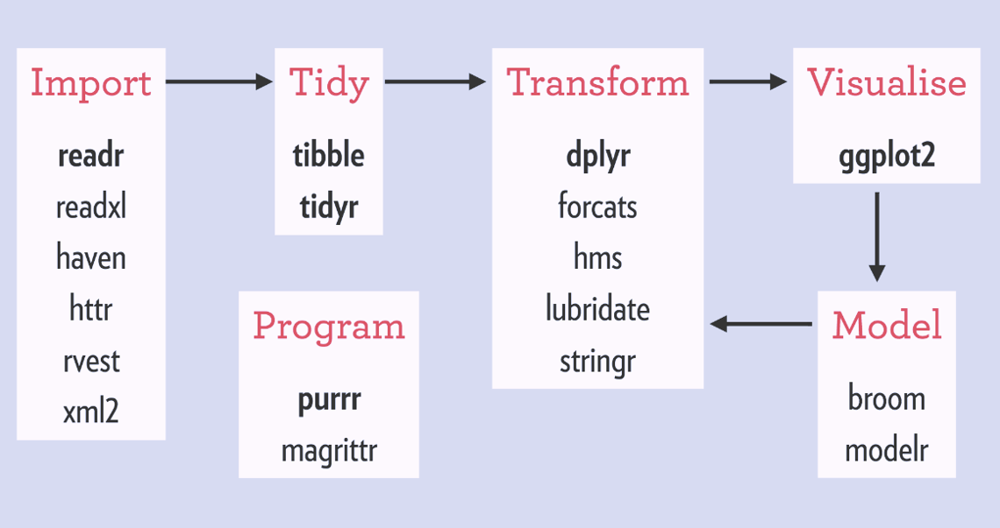
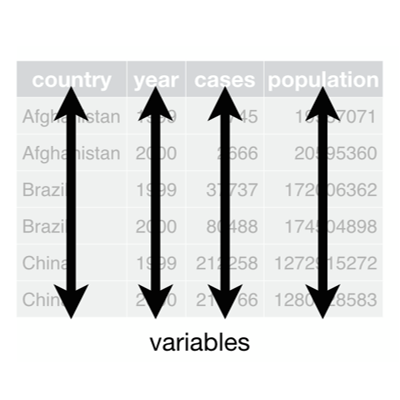
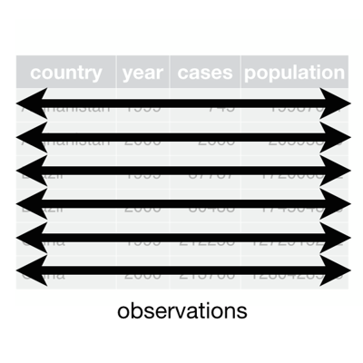
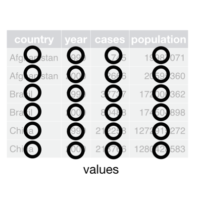
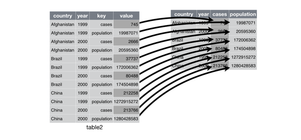
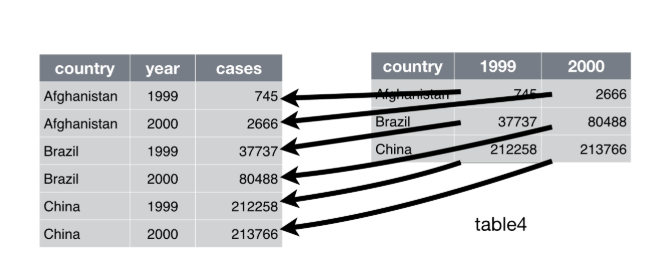

```{r setup, include=FALSE}
knitr::opts_chunk$set(echo = TRUE, fig.height = 4.35, fig.width = 4.75)
```

```{r, include=FALSE}
notes<-params$notes
```

# Reporting analysis with Rmarkdown and GitHub

## Rmarkdown & GitHub

- Rmarkdown creates dynamic reports in HTML, PDF, and Word
- Combine text (using the markdown language) and R code
- Rmarkdown runs R code, compiles, and produces a report in chosen format
- This presentation was created using Rmarkdown!

## Day 1, Part 2 Exercise

1) Open the `day4_Rmd-datamanip1_exercises.Rmd`
2) Save as: `Day4Exercise_LastnameFirstname.Rmd`.
2) Read in the gapminder data set
3) As you answer questions, be sure to annotate your work with as much detail as possible!

# Advanced data manipulation, part 1: reshaping and merging

Let's get set up!

## A new dataset

California energy data

- file names: `ca_energy_generation.csv` and `ca_energy_imports.csv`
- Read these two files into your working environment
    - They are in the "data" folder

## Reading in the data

```{r importing, warning=F, message = F}
library(tidyverse)
generation <- read_csv("../data/ca_energy_generation.csv")
imports <- read_csv("../data/ca_energy_imports.csv")
```

## Tidy data: What the heck is the `tidyverse`?

>- “System of packages for data manipulation, exploration, and visualization that share a common design philosophy” - Rickert
>- Mainly developed by Hadley Wickham 
>- These packages work together using consistent language structures—once you learn it, these packages will feel as one

## Tidy data: Tidyverse packages 



## What is Tidy Data?

>- "Happy families are all alike; every unhappy family is unhappy in its own way" - Leo Tolstoy 
>- "Tidy datasets are all alike, but every messy dataset is messy in its own way" - Hadley Wickham
>- Basically, tidy data are the way your data should be organized 

## Three rules for tidy data:

1. Each variable must have its own column.
2. Each observation must have its own row.
3. Each value must have its own cell. 

## 1. Each variable must have its own column 



## 2. Each observation must have its own row



## 3. Each value must have its own cell. 



## Long to wide 



## Wide versus long data

- Often, we want to make wide data long (or tidy) for analysis



## Wide versus long data

```{r wide data}
head(generation)
```


## Using `reshape2`

- `gather` --> make data long
- `spread` --> make data wide

## Reshaping CA energy data

- Right now, the `generation` dataframe has several observations per row

```{r untidy data}
head(generation)
```

## `gather` the generation data

`gather(df, key = new column name for key variable, value = new column name for data)`

- Specify the variable that _doesn't_ gather through `-variable` (or specify the ones you want to gather)

```{r gather}
long_gen <- gather(generation, key = source, value = usage, -datetime)
head(long_gen)
```

## reordering the `gather` the generation data by time

```{r reordering}
head(long_gen[order(long_gen$datetime), ])
```

```{r}
spread(long_gen, key = source, value = usage) %>% slice(1:5)
```

# Dealing with dates/time
How the heck am I supposed to work with "2019-09-03 00:00:00"?

## Dealing with dates and times

- Notice that the first variable in both dataset is the called "datetime"
- What class are these variables?

```{r}
class(generation$datetime)
class(imports$datetime)
```


## Dealing with dates/times: `lubridate`

- The best way to deal with date-time data is to use the `lubridate` package
- You can convert character variables into datetime format using the `as_datetime` function
    - One advantage of `readr::read_csv` is that it will often detect and convert datetime variables when importing

```{r, warning=F, message=F}
library(lubridate)
```

## Dealing with dates/times with `lubridate`
```{r datetime}
generation$datetime <- as_datetime(generation$datetime)
head(generation$datetime)
```


```{r}
imports$datetime <- as_datetime(imports$datetime)
head(imports$datetime)
```

# Merging data

## Merging CA energy data

- Sometimes you have data from two (or more) sources that you want to analyze 
- Need to merge these dataframes together
- To merge, need to chose the columns that have common values between the dataframes
  - Usually a variable with ids or years, or both
  
## Merging the `merge`

`merge(x, y, by = c("id", "year"))`

- Key arguments: 
  - `x`: first dataframe
  - `y`: second dataframe
  - `by`: variables to match (must have common name)

## More `merge` arguments

```{r, eval = F}
merge(x, y, by.x = "id", by.y = "cd", all.x = T, all.y = T)
```

- Advanced arguments:
  - Use `by.x` and `by.y` if the dataframes have different variable names
  - Use `all.x = T` if you want to keep all the observation in the first dataframe (unmatched observations in `y` are dropped!)
  - Use `all.y = T` if you want to keep all observations in the second dataframe (umatched observations in `x` are dropped!)
  - Use both (or, simply `all = T`) to keep all observations!
  - By **default** R will drop unmatched observations from **both** dataframes!

## Merge by `datetime`

- Use `merge` to join the `generation` and `imports` dataframes, using the `datetime` variable to match

## Merge by `datetime`

- Always check your merge!

```{r merge}
merged_energy <- merge(generation, imports, by = "datetime")
dim(merged_energy)
head(merged_energy)
```

## Try reshaping the merged data!

- Our merged dataframe is still wide and untidy
  - Create a long version called `long_merged_energy`
  - Take a peek to make sure the long version looks correct

## Try reshaping the merged data!

```{r gather exercise}
long_merged_energy <- gather(merged_energy, key = source, value = usage, -datetime)
head(long_merged_energy)
```
