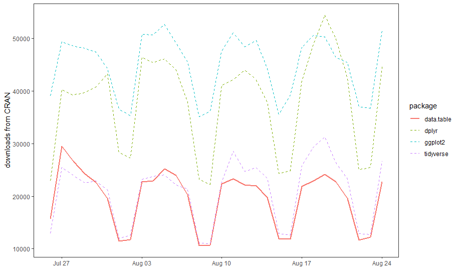

```{r setup, include=FALSE}
knitr::opts_knit$set(root.dir = normalizePath("../"))
knitr::opts_chunk$set(echo = TRUE, warning = FALSE)
```

```{r, include=FALSE}
notes<-params$notes
```

# Introduction

## What is `data.table`?

> - "`data.table` is an R package that provides an enhanced version of data.frames" 
> - "Briefly, if you are interested in reducing programming and compute time tremendously, then this package is for you." 

  > - [authors of `data.table`](https://cran.r-project.org/web/packages/data.table/vignettes/datatable-intro.html)
  
  


## Why do we care?

> - `data.table` is popular

data pulled using `cranlogs` package

## 

- `data.table` is fast (especially on larger data) (<span style="color: blue;">data.table</span>, <span style="color: red;">dplyr</span>)

https://h2oai.github.io/db-benchmark/

## 

- `data.table` is memory efficient  (<span style="color: blue;">data.table</span>, <span style="color: red;">dplyr</span>)

https://h2oai.github.io/db-benchmark/

## Additional reasons to care

> - `data.table` comes with other features (file i/o, reshape functions)
> - no need for multiple package dependencies
> - syntax is clean, compact, and consistent
> - `data.tables` are compatible with any function that takes `data.frame`s

# `data.table` basics

## Load data

Load the same data as a `data.frame` and as a `data.table` to compare.

```{r, echo=TRUE, results = 'hide', message=FALSE}

# import data.table library
library(data.table)

data_file <- here::here("data", "ca_energy_generation.csv")

# read in two versions of data, one as a data.frame and one as a data.table
generation_df <- read.csv(data_file, stringsAsFactors = F)

generation_dt <- fread(data_file)

```

## `data.table` inherits from a `data.frame`.

```{r, echo=TRUE}

class(generation_df) 
class(generation_dt) 

```

```{r, echo=TRUE, eval=FALSE}

View(generation_df)
View(generation_dt)
generation_df
generation_dt
str(generation_df)
str(generation_dt)

```


# How to use `data.table`s

## `data.table` syntax

> - `dplyr` syntax: depends on a small set of verbs
> - `data.table` syntax: small set of consistent rules input into `dt[]`
> - column names are variables inside `dt[]`
  
  https://github.com/Rdatatable/data.table/wiki
  
# `i`: "on which rows" (row filtering)

## `i`: "on which rows" (row filtering)

- logical operations filter rows

```{r dt-filter1}

generation_dt[wind > 4400]

```

## `i`: "on which rows" (row filtering)

- logical operations filter rows

```{r dt-filter2}

generation_dt[wind > 4400 & mday(datetime) == 7]

```

- note: mday is a `data.table` function that returns the integer day of the month  

## `i`: "on which rows" (row filtering)

- **try it!** select rows for which natural gas generation is less than or equal to 5,000 MW and large hydro generation is greater than 2,000 MW
- **try it!** select rows for which solar generation is greater than coal generation
- **bonus:** select rows for which coal generation is greater than 10 MW and solar generation is greater than the median value of solar generation

## `i`: "on which rows" (row filtering)

- **try it!** select rows for which natural gas generation is less than or equal to 5,000 MW and large hydro generation is greater than 2,000 MW
```{r dt-filter-exercise1, eval=FALSE}

generation_dt[natural_gas <= 5000 & large_hydro > 2000]

```
- **try it!** select rows for which solar generation is greater than coal generation
```{r dt-filter-exercise2, eval=FALSE}

generation_dt[solar > coal]

```
- **bonus:** select rows for which coal generation is greater than 10 MW and solar generation is greater than the median value of solar generation

```{r dt-filter-exercise3, eval=FALSE}

generation_dt[coal > 10 & solar > median(solar)]

```

# `j`: "what to do" (column operations)

## `j`: "what to do" (column operations)

- perform any operation in `j`

```{r dt-columns-1}

generation_dt[,wind]

```

- note: what is the data type returned?

## `j`: "what to do" (column operations)

- perform any operation in `j`

```{r dt-columns0}

generation_dt[,wind + solar]

```

## `j`: "what to do" (column operations)

- perform any operation in `j`

```{r dt-columns1}

generation_dt[,3*wind + solar*biogas/2]

```

## `j`: "what to do" (column operations)

- perform any operation in `j`

```{r dt-columns2}

generation_dt[,mean(nuclear)]

```

## `j`: "what to do" (column operations)

- a bit of syntax in `j` can either create a new column (`:=`) or return a new `data.table` ( .() )

## `j`: "what to do" (column operations)

- adding or modifying columns within the `data.table` uses `:=` (in place!)
```{r}

generation_dt[,morewind := 5*wind]
generation_dt[,all_RE := wind+solar+geothermal]
generation_dt[,morewind := 5*morewind + 10]

```

- returning a new `data.table` uses `.()` (list alias). What do these return?

```{r, eval=FALSE}

generation_dt[,.(wind)]
generation_dt[,.(RE_combo = 3*wind + solar*biogas/2)]
generation_dt[,.(RE_combo = 3*wind + solar*biogas/2,
                 high_wind = morewind)]
```

## `j`: "what to do" (column operations)

- columns may be deleted in `j`

```{r}
generation_dt[,morewind := NULL]
generation_dt[,all_RE := NULL]

```

## `j`: "what to do" (column operations)

- **try it!** add a column to generation_dt called "total_hydro" that is the sum of the `small_hydro` and `large_hydro` 
- **try it!** return a new `data.table` with two columns: the mean of the `nuclear` column and the mean of the `biogas` column. What happens when you don't name those columns?

## `j`: "what to do" (column operations)

- **try it!** add a column to generation_dt called "total_hydro" that is the sum of the `small_hydro` and `large_hydro` 
```{r}
generation_dt[,total_hydro := small_hydro + large_hydro]
```
- **try it!** return a new `data.table` with two columns: the mean of `nuclear` and the mean of `biogas`. What happens when you don't name those columns?
```{r}
generation_dt[,.(mean_nuc = mean(nuclear), mean_biogas = mean(biogas))]
generation_dt[,.(mean(nuclear), mean(biogas))]
```

## combine `i` and `j` operations

- **try it!** for the hours (rows) when wind generation is greater then 4,500 MW, add 500 to the values of small_hydro

- **try it!** when solar generation is zero, reurn a `data.table` with two columns: `datetime` and `total_thermal` (sum of natural gas and coal generation)

- **bonus** Use `:=` to create a new column called more_solar (which is 9 times the values in the solar column) but only for hours where solar > 0. What happens in the other rows?

## combine `i` and `j` operations

- **try it!** for the hours (rows) when wind generation is greater then 4,500 MW, add 500 to the values of small_hydro

``` {r, eval=FALSE}
generation_dt[wind > 4500, small_hydro := small_hydro + 500]
```

- **try it!** when solar generation is zero, reurn a `data.table` with two columns: `datetime` and `total_thermal` (sum of natural gas and coal generation)

``` {r, eval=FALSE}
generation_dt[solar == 0, .(datetime, total_thermal = natural_gas + coal)]
```

- **bonus** Use `:=` to create a new column called more_solar (which is 9 times the values in the solar column) but only for hours where solar > 0. What happens in the other rows?

``` {r, eval=FALSE}
generation_dt[solar > 0, more_solar := solar*9]
```

This will fill in the rest of the rows (where solar > 0 is not true) with NA.


# `by`: "grouped by what"

## `by`: "grouped by what"
  
- add grouping to any operation
- what does this do?

```{r dt-group}

generation_dt[,mean(nuclear), by = mday(datetime)]

```

>- how could you add more useful names to these columns? 
  
## `by`: "grouped by what"
  
- adding more useful column names:

```{r}

generation_dt[,.(mean_nuc = mean(nuclear)), by = .(day = mday(datetime))]

```
  
## `by`: "grouped by what"
  
- this is where we can see the (now familiar) power of long form data:

```{r }
# melt generation_dt
generation_dt_long <- melt(generation_dt, 
                           id.vars = "datetime", 
                           variable.name = "gen_type", 
                           value.name = "MW")

```

- what is that warning message about? (hint: check str(generation_dt)). How could this be avoided in the future?

## `by`: "grouped by what"
  
- now find the mean of MW by gen_type...

```{r }
generation_dt_long[,.(mean_MW = mean(MW)), by = gen_type]

```
  
- or by day and by gen_type...

```{r }
generation_dt_long[,.(mean_MW = mean(MW)), 
                   by = .(day = mday(datetime), gen_type)]

```  

- note that by accepts: a single column name, a list, or a character vector 
  
## `by`: "grouped by what"
  
- `by` combines easily with everything we've learned about `i` and `j`
- example: find the mean and sum of generation for each day, for all resources EXCEPT natural gas

```{r dt-group2}

generation_dt_long[gen_type != "natural_gas",
                   .(mean_MW = mean(MW), sum_MW = sum(MW)), 
                   by = mday(datetime)]

```
  
## `by`: "grouped by what"

- **try it!** find the median solar generation by hour. 
- **try it!** for hours when the solar generation is greater than zero, find the maximum natural gas generation by day

## `by`: "grouped by what"
  
- **try it!** find the median solar generation by day 
```{r, eval=FALSE}
generation_dt[,median(solar), by = mday(datetime)]

generation_dt_long[gen_type == "solar", median(MW), by = mday(datetime)]
```

- **try it!** for hours when the solar generation is greater than zero, find the maximum natural gas generation by day

```{r, eval=FALSE}
generation_dt[solar > 0, max(natural_gas), by = mday(datetime)]

```

## `data.table` syntax recap

  

> - the combination of `i`, `j`, and `by` is very powerful
> - column names are variables inside `dt[]`
> - few other components; outside scope of this review

# `data.table` upgrades to other functions

## `data.table` upgrades to other functions

`data.table` contains its own versions some functions we've already talked about, for example. These generally are optimized for `data.table`s and have extra (advanced) features. 

> - `melt`
> - `dcast`
> - `merge`
> - `order`

## `dplyr` -> `data.table`

We can now practice toggling between `dplyr` and `data.table` syntax.

**try it!** Convert this `dplyr` syntax into `data.table` syntax (remember that this melted the generation table, then found the mean of large_hydro and biomass generation)

```{r, eval=FALSE, echo=TRUE}

generation_dt %>% 
  select(datetime, large_hydro, biomass) %>% 
  melt(id.vars = "datetime",
       variable.name = "source",
       value.name = "usage") %>% 
  group_by(source) %>% 
  summarize(mean_usage = mean(usage, na.rm = T))

```

## `dplyr` -> `data.table`

**try it!** Convert this `dplyr` syntax into `data.table` syntax (remember that this melted the generation table, then found the mean of large_hydro and biomass generation)

```{r, eval=FALSE, echo=TRUE}

generation_dt %>% 
  select(datetime, large_hydro, biomass) %>% 
  melt(id.vars = "datetime",
       variable.name = "source",
       value.name = "usage") %>% 
  group_by(source) %>% 
  summarize(mean_usage = mean(usage, na.rm = T))

# becomes
generation_dt_long <- melt(generation_dt, 
                           id.vars = "datetime", 
                           variable.name = "gen_type", 
                           value.name = "MW")

generation_dt_long[gen_type %in% c("large_hydro", "biomass"),
                   .(mean_usage = mean(MW)),
                   by = gen_type]

```

# A few more `data.table` properties and bonus features


## `set` functions

- Remember `:=` ? It is part of `data.table`'s `set` functions, which all update properties of the `data.table` by reference

```{r, eval=FALSE, echo=TRUE}
# set colum
dt[,col1 := 2*col2]

# set column names
setnames(dt, "old", "new")

# set row order
setorder(dt, col1, -col2, ...)

# set anything
set(dt, i, j, value)

```

- we won't do exercises with these, but these are important to know about

## `fread` and `fwrite`

> - "Fast and friendly file finagler" - _help file_
> - "Similar to read.table but faster and more convenient" - _help file_
> - `stringsAsFactors=FALSE` already set

## fread benchmarks

```{r, eval=FALSE, echo=TRUE}

# example, no need to run this
library(rbenchmark)

# this will run each command 500 times and report the average time taken

# 168 lines
data_file <- "generation.csv"
benchmark(read.csv(data_file, stringsAsFactors = F), 
          fread(data_file), 
          replications = 500)

#                                        test replications elapsed relative user.self sys.self user.child sys.child
# 2                          fread(data_file)          500    0.62    1.000      0.50     0.12         NA        NA
# 1 read.csv(data_file, stringsAsFactors = F)          500    0.67    1.081      0.54     0.13         NA        NA

# 12,600 lines
data_file_medium <- "generation_medium.csv"
benchmark(read.csv(data_file_medium, stringsAsFactors = F), 
          fread(data_file_medium))

#                                               test replications elapsed relative user.self sys.self user.child sys.child
# 2                          fread(data_file_medium)          100    0.77    1.000      0.72     0.05         NA        NA
# 1 read.csv(data_file_medium, stringsAsFactors = F)          100    4.28    5.558      4.22     0.06         NA        NA

# 1,008,000 lines
data_file_large <- "generation_large.csv"
benchmark(read.csv(data_file_large, stringsAsFactors = F), 
          fread(data_file_large),
          replications = 20)

#                                              test replications elapsed relative user.self sys.self user.child sys.child
# 2                          fread(data_file_large)           20    2.67    1.000      7.07     1.10         NA        NA
# 1 read.csv(data_file_large, stringsAsFactors = F)           20   74.59   27.936     71.53     3.05         NA        NA

```

## Special variables

`data.table`s also contain some special read-only symbols that are often useful: 

- `.N`: number of rows in the current group
- `.I`: a vector, `1:nrow(dt)`, usually used for more advanced operations

```{r, eval=FALSE, echo=TRUE}

# for .N: convenient
generation_dt[,.N] 

# for .I: more advanced syntax
generation_dt[,.I]

```

## Special variables

**try it!** Use `.N` to find the number of rows in generation_dt_long

**try it!** Use `.N` to find the number of hours in which solar generation was greater than 500 MW


## Special variables

**try it!** Use `.N` to find the number of rows in generation_dt_long

```{r, eval=FALSE, echo=TRUE}

generation_dt_long[,.N]

```

**try it!** Use `.N` to find the number of hours in which solar generation was greater than 500 MW


```{r, eval=FALSE, echo=TRUE}

generation_dt[solar > 500, .N]
generation_dt_long[gen_type == "solar" & MW > 500,.N]

```

## Other features: keys

- keys: one or more columns, pre-sorted index of the table. Setting a key makes joining and other operations much faster, because rows are already sorted (note: set function)
- I rarely use it unless I'm working with lots of data, mostly because I prefer to explicitly name columns for clarity (when possible)

```{r, eval=FALSE, echo=TRUE}

# check the current key
key(generation_dt)

# set key
setkey(generation_dt, datetime)
key(generation_dt)

```

## Other features: joins

- joins: `data.table` has a special join syntax

```{r, echo=TRUE}

imports_dt <- fread(here::here("data", "ca_energy_imports.csv"))

imports_dt

```

## Other features: joins

- joins: `data.table` has a special join syntax. this returns a new `data.table`. It does not modify imports_dt in place

```{r, echo=TRUE}

# set key or specify on 
imports_dt[generation_dt, on = "datetime"]

```

## Other features: joins

- joins: `data.table` has a special join syntax. this does modify imports_dt in place (the presence of `:=` is a hint)

```{r}
# operations can be performed in the same step as the merge
imports_dt[generation_dt, on = "datetime", imports_gas := imports + i.natural_gas]

imports_dt
```

## Other features: joins

- joins: `data.table` has a special join syntax. This can become very complex if you want it to!

```{r}
# operations can be performed in the same step as the merge
imports_dt[generation_dt[hour(datetime) == 2], on = "datetime", imports_gas_2 := imports + i.natural_gas]

imports_dt
```

# Final thoughts

## Final thoughts

- developers: Matt Dowle, Arun Srinivasan (look out for them on stack overflow)
- useful [introduction](https://cran.r-project.org/web/packages/data.table/vignettes/datatable-intro.html) to `data.table`
- also  useful `data.table` [FAQ](https://cran.r-project.org/web/packages/data.table/vignettes/datatable-faq.html)
- [Intro to advanced features](https://cran.r-project.org/web/packages/data.table/vignettes/datatable-reshape.html) of `data.table` `melt` and `dcast` functions
- or any other vignette


